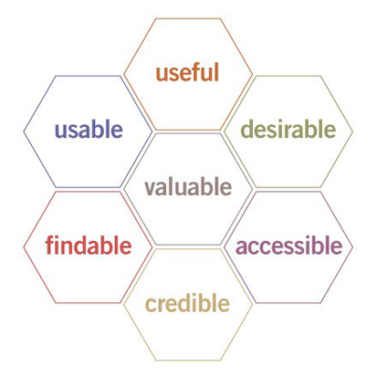
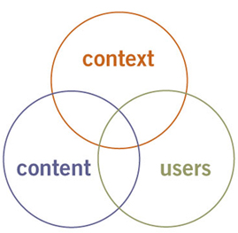
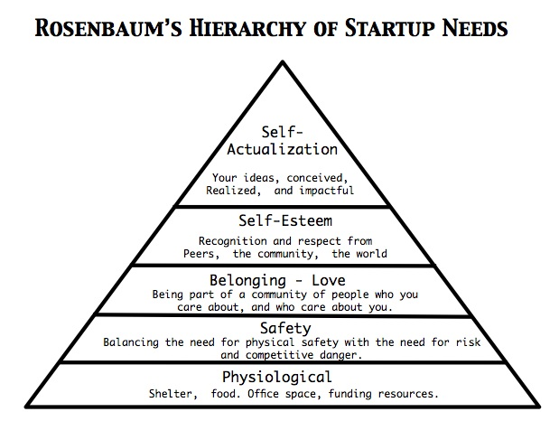
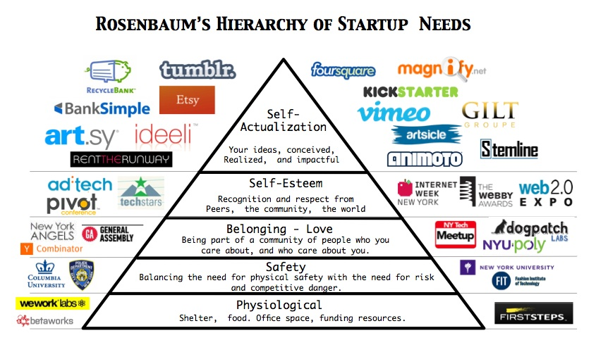

!SLIDE
# Code Literacy for Lean Teams
## AgileUX NYC 2012
## Jonathan Berger, Pivotal Labs

!SLIDE
# What it says on the tin
> Real world agile teams, traditionally defined rigid roles are rapidly being displaced by a culture of collective ownership of the product. Responsibilities are being decoupled from specialties by a collection of operators with overlapping skills, and chief among them is technical acumen.

!SLIDE
## What it says on the tin, cont'd
> Every day, it makes less and less sense to talk about skill sets as collections of binary "I can do this"'s or "I don't do that"'s. In this talk, we'll investigate how treating Coding as Literacy can affect the way decisions are made and work gets done, describe what varying levels of literacy among teammates, facilitate doing agile well, and discuss how to get literate in technical topics.

!SLIDE
# Overview: Coding as Literacy
- 1 Coding as Literacy / Intro
- 2 How literate does each role need to be do do agile well? 
- 3 Becoming Literate

- we'll investigate how treating Coding as Literacy can affect the way decisions are made and work gets done, 
- describe what varying levels of literacy among teammates facilitate doing agile well, 
- discuss how to get literate in technical topics.

!SLIDE
## &sect;1: Intro

!SLIDE
## Who am I?
- designer & developer at Pivotal Labs
- I've been actively learning for ~5 years
- that means I'm either really good at it or really bad

!SLIDE
## I talked about Git at FOWD[] 
- ...and when Ryan said 'git', the room emptied
- he also said "We don't hire designers who can't code",
- and in a few years, no one will

!SLIDE
### Wiley Wiggens says 
> "I don't want to *be* anything, I want to *do* everything"

!SLIDE
## I've been thinking about Code as Literacy for years
- it's a good way to talk about coding, which is often treated as a binary
- The success of Code Year has made me think I don't need to present this as an argument, so I'm gonna plunge ahead
- (show of hands) how many ppl have "get technical" as their NYE res?
- (show of hands) how's it going? Still with it?

!SLIDE
### At the Balanced Team conference[], Lane[] talked about Hybrid User Interviews
- product decisions are design decisions. Everyone makes them.

> "Design is a core competency, not a role."

!SLIDE
# Chris Dixon nails it:
> **Should non-technical people at tech startups learn to code?** This is where I disagree with some of the conventional wisdom. Certainly it is worthwhile learning programming, at least for reasons 3 & 4 above. You should realize, however, that 

!SLIDE
> to become a good programmer takes thousands of hours of practice. 

- @cdixon

!SLIDE
> I'd also argue that if you are a non-technical person working at a web company the the first thing you should learn is internet architecture (DNS, http, html, web servers, database, TCP/UDP, IP, etc). 

- @cdixon

!SLIDE
> Learning some programming is good too, to help relate to technical colleagues. But if your goal is to build a large-scale web service, your time as a non-technical person is better spent recruiting people who have been coding for years.

- @cdixon

!SLIDE
## Let's talk about Code Literacy in the context of Agile UX

!SLIDE
## §2: How literate does each role need to be do do agile well?

!SLIDE
# my thesis 
is that appropriate levels of code literacy correlate w/ more successful outcomes

!SLIDE
# where can literacy help? 
- Designer, PM: better tactical design choices (and every choice is a design choice)
- Principal: better strategic design choices, more realistic estimates, better analytical tools

!SLIDE
# where can literacy hurt?
- Design, PM, Principal: time / opportunity cost, overstepping bounds, wrong direction
- Dev: tunnel vision can skew priorities, 

!SLIDE
# In general, more literacy is better 
(no matter what the role)

!SLIDE
# HOWEVER
be mindful of your role

!SLIDE
# estimation should be done
by those doing the work; don't overstep bounds

!SLIDE
# protect the naive space; 
organizationally, its very important to always retain the ability to look at a problem w/ fresh eyes to engender innovative solutions

!SLIDE
Not Knowing can help come up w/ innovative solutions
# But 
so can Knowing and having other context, 

a little knowledge is a dangerous thing
AND
knowledges is power

# for example
using static design to direct attention instead of animation

!SLIDE
## §3: How to get literate?
- be realistic about your goals
  - a lot of promises are made to sell this stuff. Chill out.
- 10 ways
- getting there yourself

!SLIDE
# 6+1 Ways Code Literacy Makes for Better UX
I'm going to tear through a handful of technical concepts in modern web design; treat this as a list of 'good to know's. Find out more here <LINK>.

!SLIDE
### 6+1 Ways Code Literacy Makes for Better UX
1. Internet Architecture: (DNS, http, html, web servers, database, TCP/UDP, IP, etc)
2. Database Nouns
3. HTTP Verbs: what are the atoms of the web
4. REST: Using those verbs (check that this is a formal def'n of REST)
- What's an API?
5. (Live) Style Guide Driven Design
6. JavaScript: what can you do with interaction design
7. Cucumber: personae live
8. don't forget mobile. also, don't be afraid to say "mobile's hot, but not my specialty." This doesn't preclude 'mobile first'. 

!SLIDE
# 1. Internet Architecture: 
Helps UXers understand the domain they're working with. Just as print designers have a good handle on the properties of papers and ink and the process of printing, web designers should understand the web.

- DNS: the internet's Yellow Pages
- http: HyperText Transfer Protocol
- html: HyperText Markup Language
- Web Servers: apache, nginx, 
- Database: MySQL, PostgreSQL, {NoSql: MongoDB, Redis, etc}
- TCP/UDP: packet switching. you don't really need this
- IP: ditto

!SLIDE
# 2. Database Nouns
Persistent Storage

- CREATE
- READ
- UPDATE
- DESTROY

!SLIDE
#3. HTTP Verbs: 
Understanding the basic verbs of HTTP teaches which actions are affordances of the web.

- PUT
- POST
- GET
- DELETE

!SLIDE
#4. REST: Using those verbs (check that this is a formal def'n of REST)
"Representational State Transfer". REST is an architectural style that makes building apps cleaner. Think of it as a design constraint. If you can look at any feature or mockup you create and answer "what verbs and nouns are involved?" you'll do most of the work of the developers.

!SLIDE
# 4. (Live) Style Guide Driven Design
Become literate enough in HTML and CSS to practice Style Guide Driven Design. This works well for larger systems, and entails keeping all design elements in a style guide. When developing features, mocks are made using very rough wireframes that reference the Style Guide (e.g., "Sign-in form" or "secondary-action button"). Any new features must either use existing design elements, or treat the development of the new element as a feature.

!SLIDE
#5. JavaScript
How does becoming JS-literate make for better UX? Learn enough JS to understand what can you do cheaply with interaction design. The JQueryUI library is very popular, and a good place to start.

!SLIDE
#6. Cucumber: personae live
How does becoming Cucumber-literate make for better UX? If you're fortunate enough to be doing TDD, learn Cucumber. It's a great way to think through problems and communicate w/ developers. Given / When / Then. Also, use your personas in Cucumber stories.

!SLIDE
#7. What about Mobile?

Bootstrap? Skeleton? Sencha?

don't forget mobile. also, don't be afraid to say "mobile's hot, but not my specialty." This doesn't preclude 'mobile first'. 
http://www.getskeleton.com/
http://www.sencha.com/products/touch
http://twitter.github.com/bootstrap/

!SLIDE
# Don't forget 
sometimes design is an **ineffable value-add** and code needs to take the backseat.
BONUS: preserve the ability / reserve the right to stay innocent and come up with crazy ideas that the Technically Literate might not come up with.

!SLIDE
# Recommended resources

## Courses
- Code Year
- Method.ac
- lynda
- railstutorial.org
- getHopscotch.com
- treehouse / carsonified
- think vitamin?

## Resources
- ruby rogues
- ruby show
- dribble, forrst, stackoverflow
- SO should get its own mention: "this is the first google result you should hit"
- do a little research; google, check my RSS

!SLIDE 
# junk

!SLIDE
# More ideas:
## Does Maslow map to this stuff?

Steve Rosebaum [maps it out](http://www.huffingtonpost.com/steve-rosenbaum/startup-survival-guide-ma_b_1071640.html).

## How about the UX Honeycomb?
Peter Moreville talks about it [here](http://semanticstudios.com/publications/semantics/000029.php).

- rushkoff
- code year
http://primerlabs.com/codeliteracy

- agile teams / roles
  - product owner
  - engineer
  
- which roles need to code? how much?

## to do
- check out the Pivotal Design survey for themes from developers
- include getHopskotch.com